# 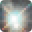 Nebulosa

The complete integrated solution for all of your astronomical imaging needs.

## Home

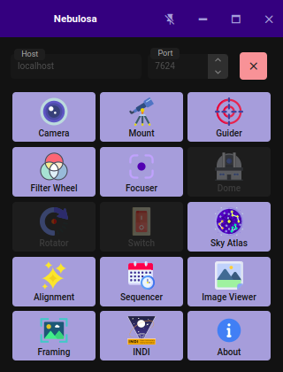

## Camera

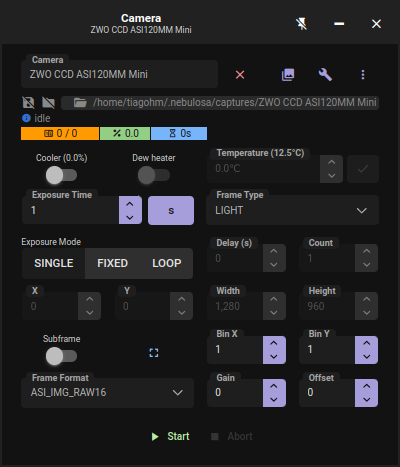

## Mount

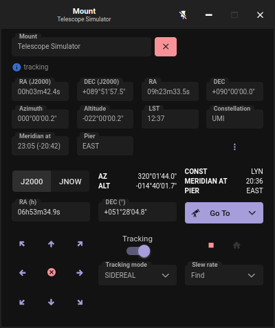

## Focuser

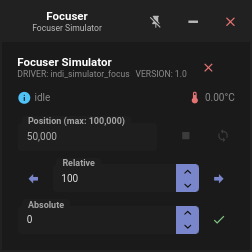

## Filter Wheel

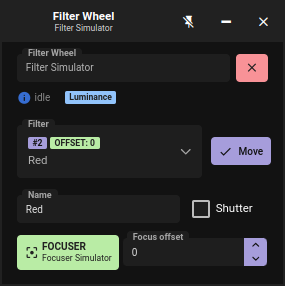

## Rotator

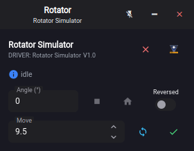

## Guider

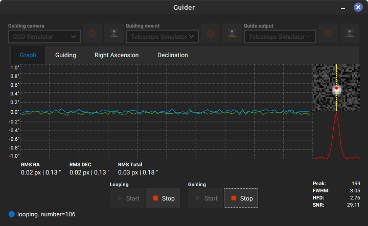

## Sky Atlas

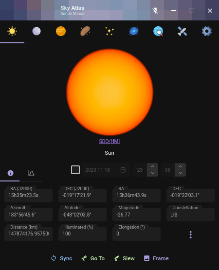

## Image

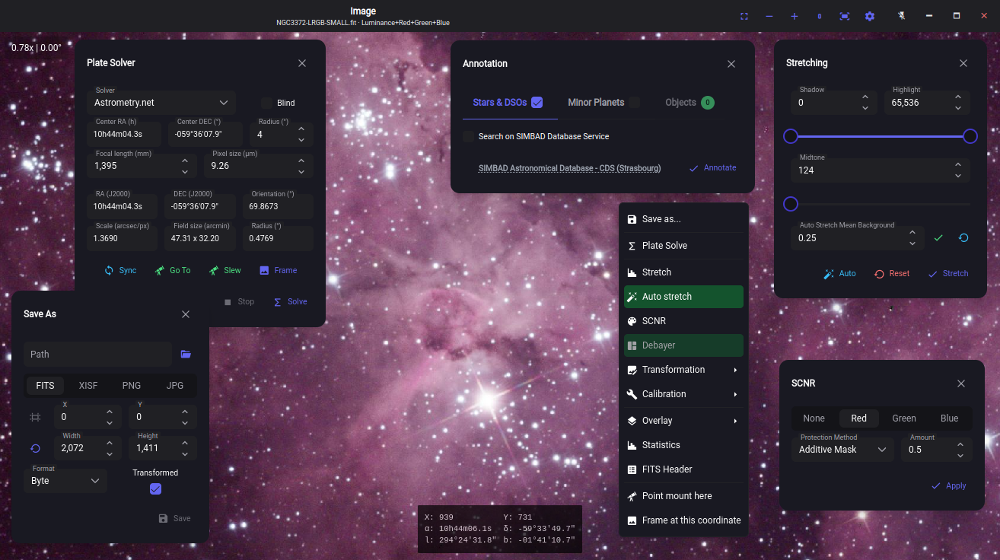

## Framing

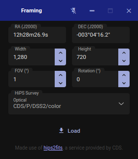

## Alignment

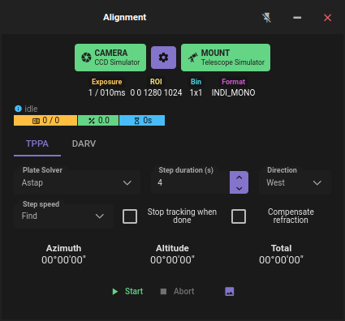

## Flat Wizard

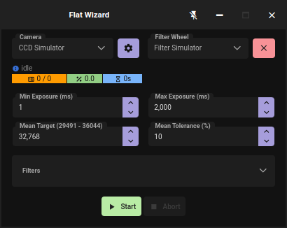

## Auto Focus

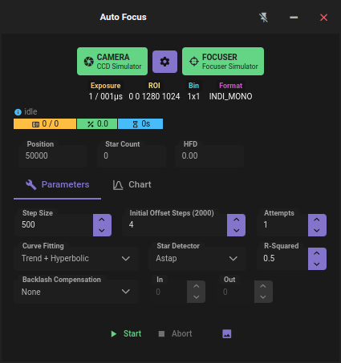

## Sequencer

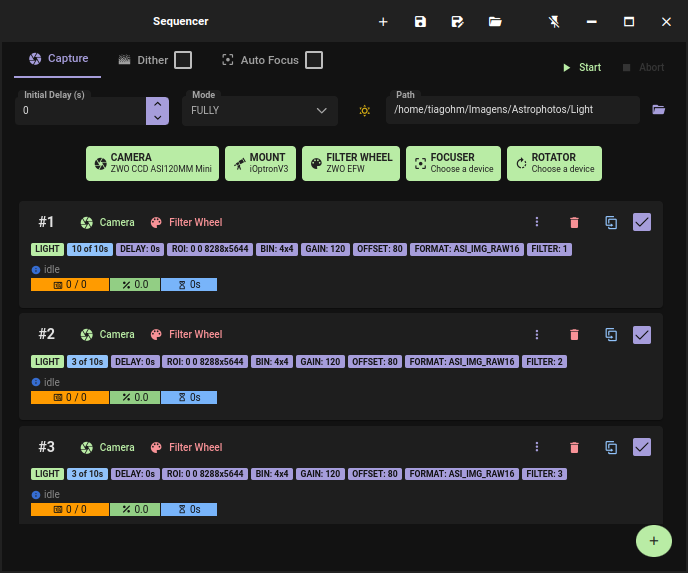

## Stacker

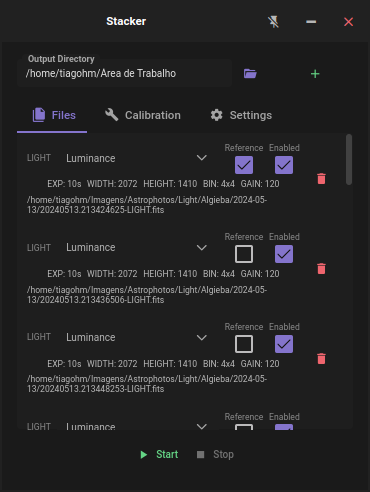

## INDI

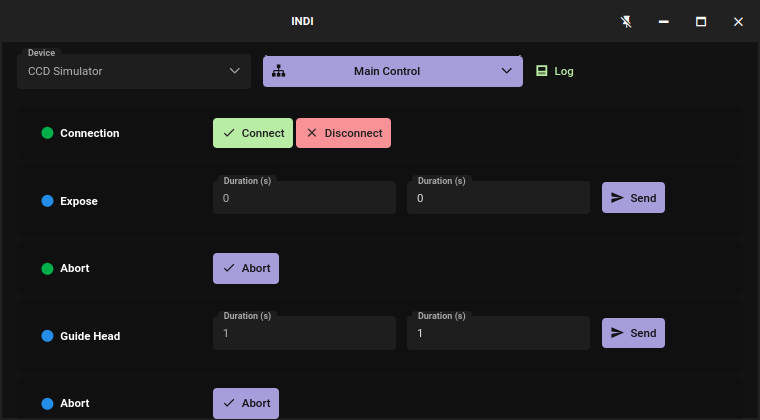

## Calculator

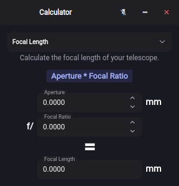

## Settings

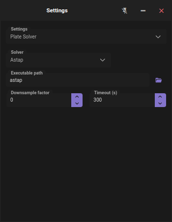

## Support me

