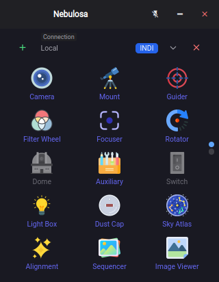
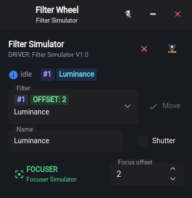
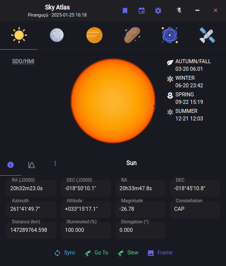
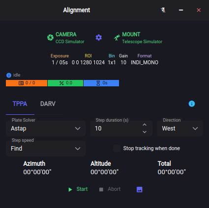
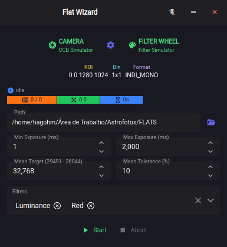
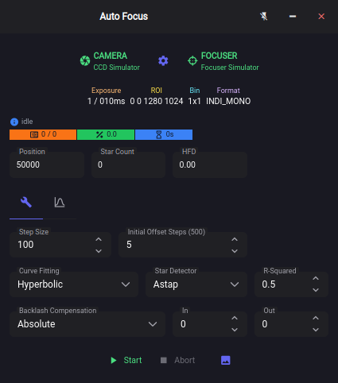
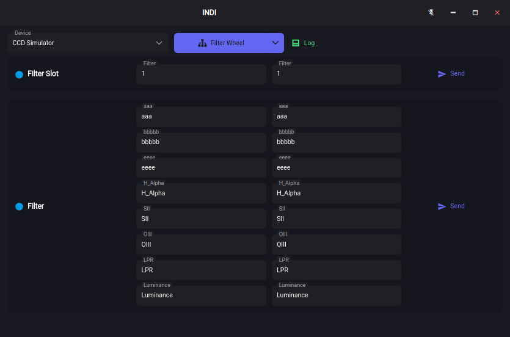
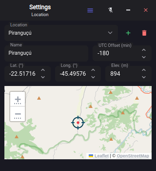

#  Nebulosa

The complete integrated solution for all of your astronomical imaging needs.

## Home

## Camera

## Mount

## Focuser

## Filter Wheel

## Rotator

## Guider

## Sky Atlas

## Image

## Framing

## Alignment

## Flat Wizard

## Auto Focus

## Sequencer

## Stacker

## INDI

## Calculator

## Settings

## Support me

